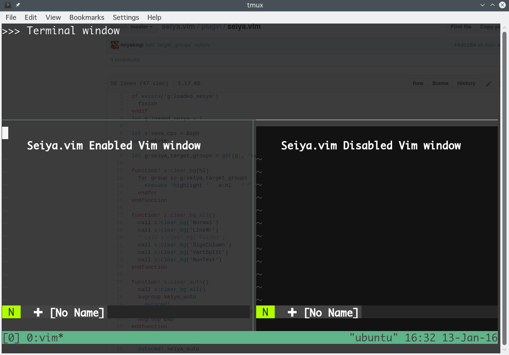

Seiya.vim
=========

Vim plugin to clear and make transparent background color in (transparent) terminal.

## Screen shot



## Usage

### Commands

#### Enable

`:SeiyaEnable`

#### Disable

`:SeiyaDisable`

If backgroung color is not updated, try `colorshame [your_colorscheme]`

### Configuration

#### Automatically enable when vim starts

Add this line in your vimrc. By default, this option is disabled.

```vim
let g:seiya_auto_enable=1
```

#### Change highlight groups to clear

This option is helpful for [Neovim](https://neovim.io/) users.

In Neovim with true-color terminal (`$NVIM_TUI_ENABLE_TRUE_COLOR=1`), this plugin does not work since gui\* highlight groups are used even when it's running on terminal. Below config solves this problem.

```vim
" Default value: ['ctermbg']
let g:seiya_target_groups = has('nvim') ? ['guibg'] : ['ctermbg']
```

